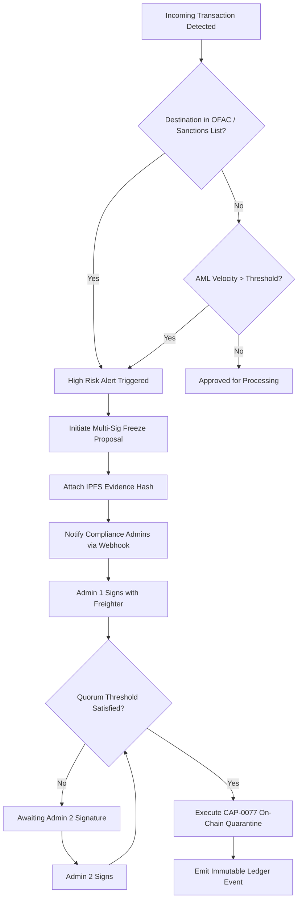
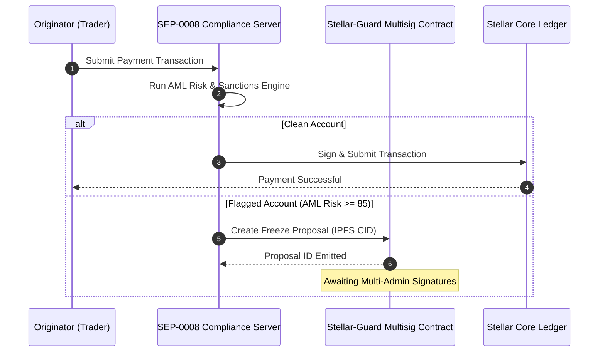

# Compliance Architecture Flowcharts

```mermaid
flowchart TD
    A[Incoming Transaction Detected] --> B{Destination in OFAC / Sanctions List?}
    B -- Yes --> C[High Risk Alert Triggered]
    B -- No --> D{AML Velocity > Threshold?}
    D -- Yes --> C
    D -- No --> E[Approved for Processing]
    
    C --> F[Initiate Multi-Sig Freeze Proposal]
    F --> G[Attach IPFS Evidence Hash]
    G --> H[Notify Compliance Admins via Webhook]
    H --> I[Admin 1 Signs with Freighter]
    I --> J{Quorum Threshold Satisfied?}
    J -- No --> K[Awaiting Admin 2 Signature]
    K --> L[Admin 2 Signs]
    L --> J
    J -- Yes --> M[Execute CAP-0077 On-Chain Quarantine]
    M --> N[Emit Immutable Ledger Event]
```

```mermaid
sequenceDiagram
    autonumber
    participant Trader as Originator (Trader)
    participant Server as SEP-0008 Compliance Server
    participant Guard as Stellar-Guard Multisig Contract
    participant Ledger as Stellar Core Ledger

    Trader->>Server: Submit Payment Transaction
    Server->>Server: Run AML Risk & Sanctions Engine
    alt Clean Account
        Server->>Ledger: Sign & Submit Transaction
        Ledger-->>Trader: Payment Successful
    else Flagged Account (AML Risk >= 85)
        Server->>Guard: Create Freeze Proposal (IPFS CID)
        Guard-->>Server: Proposal ID Emitted
        Note over Guard: Awaiting Multi-Admin Signatures
    end
```
